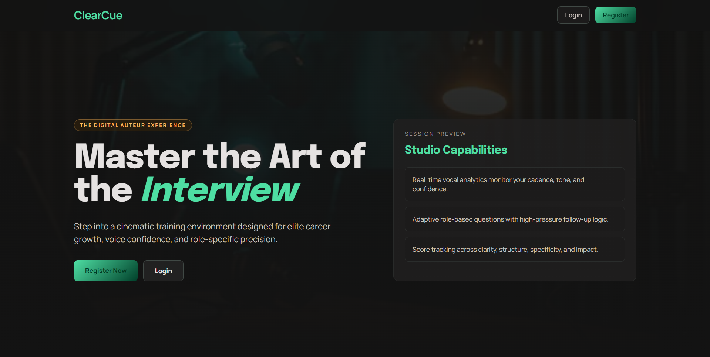

# ClearCue 🎙️

> **ClearCue** is an interactive, AI-powered interview practice application designed to help candidates prepare for their next big career move with confidence. Get real-time feedback, practice with tailored questions, and refine your pitch!

 *(Preview Placeholder)*

## ✨ Key Features

- **Personalized Interview Prep**: Tailored questions based on targeted job titles and industries.
- **AI-Powered Sessions**: Practice mock interviews utilizing the Gemini API to analyze responses and provide actionable feedback.
- **Modern User Experience**: A beautiful, responsive interface built carefully with Next.js 14 and Tailwind CSS.
- **Secure Authentication**: Robust authentication system built on NextAuth v5 featuring secure credentials and route protection.
- **Progress Tracking** *(Coming Soon)*: Review past interviews within your integrated dashboard.

## 🛠️ Tech Stack

- **Framework**: [Next.js 14](https://nextjs.org/) (App Router, Server Components)
- **Styling**: [Tailwind CSS](https://tailwindcss.com/)
- **Authentication**: [NextAuth (Auth.js) v5](https://authjs.dev/)
- **Database**: [MongoDB](https://www.mongodb.com/) + [Mongoose](https://mongoosejs.com/)
- **Language**: [TypeScript](https://www.typescriptlang.org/)
- **AI Integration**: Gemini API *(Phase 2)*

## 📂 Folder Structure

```text
clearcue-web/
├── app/                      # Next.js 14 App Router Directory
│   ├── (auth)/               # Auth routes (login, register)
│   ├── api/                  # Next.js API Routes / API Endpoints
│   ├── dashboard/            # Protected user dashboard routes
│   ├── interview/            # Protected interactive interview session routes
│   ├── globals.css           # Global stylesheets and Tailwind configurations
│   ├── layout.tsx            # Main application layout
│   └── page.tsx              # Landing page
├── components/               # Reusable React components (UI forms, buttons, layout)
├── lib/                      # Helper utilities and Database connections (e.g., mongodb.ts)
├── models/                   # Mongoose database models (e.g., User.ts)
├── public/                   # Static assets (images, icons)
├── types/                    # Global TypeScript definitions
├── auth.ts                   # NextAuth v5 base configuration
├── middleware.ts             # Edge middleware for protecting secure routes
├── next.config.mjs           # Next.js configuration
├── tailwind.config.ts        # Tailwind CSS configuration
├── .env.local                # Environment variables (Ignored by Git)
└── package.json              # Project dependencies and npm scripts
```

## 🚀 Getting Started

Follow these instructions to set up the project locally.

### Prerequisites

Ensure you have the following installed on your machine:
- Node.js (v18.x or later recommended)
- npm or yarn or pnpm
- MongoDB Atlas Account (or a local MongoDB instance)

### Installation

1. **Clone the repository:**
   ```bash
   git clone https://github.com/your-username/ClearCue.git
   cd ClearCue/clearcue-web
   ```

2. **Install dependencies:**
   ```bash
   npm install
   ```

3. **Set up Environment Variables:**
   Create a `.env.local` file in the root directory and add the following variables:
   ```env
   # Database
   MONGODB_URI=your_mongodb_connection_string

   # NextAuth
   AUTH_SECRET=a_random_32_character_secret 

   # Gemini API (Phase 2)
   GEMINI_API_KEY=your_gemini_api_key
   ```

4. **Run the development server:**
   ```bash
   npm run dev
   ```

5. **Open your browser:**
   Visit [http://localhost:3000](http://localhost:3000) to see the application in action.

## 🗺️ Roadmap Planner

- **Phase 1 (Complete):** Core Next.js scaffolding, MongoDB integration, NextAuth v5 credentials, & High-conversion polished landing pages unauthenticated routes.
- **Phase 2 (In-Progress):** Interview configuration forms (job title/industry setup), Gemini AI API integration, and interactive mock interview UI.
- **Phase 3 (Upcoming):** Audio/Speech-to-Text inputs, user dashboard history/score tracking, and detailed performance metrics.

## 🤝 Contributing

Contributions, issues, and feature requests are welcome! Feel free to check the [issues page](#) if you want to contribute.

## 📜 License

This project is licensed under the MIT License - see the [LICENSE](LICENSE) file for details.
